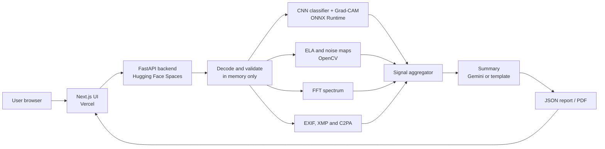

# TraceLens

**Free, open source image forensics.** Upload an image and TraceLens tells you whether it is
real, AI generated, or edited, and shows exactly where and why: a verdict, a calibrated
confidence, a Grad-CAM heatmap, Error Level Analysis and noise maps, a metadata and C2PA
provenance report, and a plain-English explanation you can export as a PDF.

> TraceLens gives probabilistic evidence, not proof. It should support human judgment, never
> replace it, especially when someone's reputation or money is at stake.

| | |
|---|---|
| Live demo | _add your Vercel URL_ |
| API docs | _add your Space URL_ + `/docs` |
| Model | _add your Hugging Face model URL_ |

## What it does

Five analysis modules run in parallel on every upload and feed one report:

| # | Module | How |
|---|---|---|
| F1 | AI image classifier | EfficientNet-B0 fine-tuned with JPEG/resize augmentation, temperature-calibrated, served with ONNX Runtime on CPU (multi-crop) |
| F2 | Explainability heatmap | Grad-CAM computed *inside* the exported ONNX graph, so no PyTorch is needed at inference |
| F3 | Classic forensics | Error Level Analysis and median-filter noise residuals, with robust (median/MAD) outlier detection and region boxes |
| F4 | Metadata and provenance | EXIF, XMP, PNG text chunks and C2PA content credentials; flags AI tool declarations, editing software, date mismatches, stripped metadata |
| F5 | Plain-English report | Gemini (free tier) rewrites the findings; a deterministic template takes over if there is no key or the quota runs out |
| F6 | Web UI | Next.js: drag and drop, side-by-side original and heatmaps, region overlays, PDF and JSON export |
| F7 | REST API | FastAPI with OpenAPI docs at `/docs` |
| F8 | Batch mode | Up to 20 images, ZIPs or PDFs, summary table and CSV export |
| + | PDF documents | Analyses the **original** embedded images (JPEG bytes and EXIF preserved, not re-rendered) and checks the PDF itself: saved revisions, creation vs modification date, editing or AI software |
| + | Paste | Ctrl+V a copied image or screenshot; the report warns that clipboard copies lose metadata |

### Verdict rules (readable on purpose)

1. A C2PA, XMP or AI-tool metadata declaration of AI generation wins outright.
2. Otherwise the calibrated classifier decides AI vs real, with an **inconclusive band from 40% to 60%**.
3. ELA, noise and metadata editing traces form a separate manipulation score; a high score gives "edited or manipulated".
4. Moderate manipulation evidence lowers confidence in "authentic" and can make it inconclusive.

The code is in [`backend/app/aggregator.py`](backend/app/aggregator.py).

## Architecture



Training runs separately on Kaggle or Colab (free GPUs), is tracked in MLflow, and the best model
is exported to ONNX and published to the Hugging Face Model Hub. GitHub Actions runs the tests on
every push and redeploys the Space.

## Repository layout

```
backend/     FastAPI service, forensic modules, pytest suite, Dockerfile (deployed to HF Spaces)
frontend/    Next.js + Tailwind web app, Playwright end-to-end tests (deployed to Vercel)
training/    Data prep, FFT baseline, EfficientNet/ResNet training, calibration, ONNX export, evaluation
docs/        Model card and the step-by-step deployment guide
.github/     CI, deploy to Spaces, keep-warm ping, Dependabot
```

## Quick start (local)

You need Python 3.11+ and Node.js 20+.

```bash
# API
cd backend
python -m venv .venv
.venv/Scripts/activate              # macOS/Linux: source .venv/bin/activate
pip install -r requirements-dev.txt
uvicorn app.main:app --reload --port 8000
```

```bash
# Web app (second terminal)
cd frontend
npm install
npm run dev
```

Open http://localhost:3000. Without a trained model the API still runs ELA, noise, FFT and
metadata checks and says so in the report; add a model (see [training/README.md](training/README.md))
to enable the classifier and Grad-CAM.

Step-by-step instructions for training and free deployment are in
[docs/DEPLOYMENT_GUIDE.md](docs/DEPLOYMENT_GUIDE.md).

## API

| Method | Endpoint | Purpose |
|---|---|---|
| POST | `/api/v1/analyze` | Analyse one image (multipart field `file`), return the full report |
| POST | `/api/v1/analyze/pdf` | Analyse a PDF (field `file`, up to 20 MB): document checks plus a full report per embedded image |
| POST | `/api/v1/analyze/batch` | Analyse up to 20 images, ZIPs or PDFs (field `files`), return a summary list |
| POST | `/api/v1/report/pdf` | Build a PDF from a report JSON |
| GET | `/api/v1/health` | Health check, model status and published metrics |

```bash
curl -F "file=@photo.jpg" http://localhost:8000/api/v1/analyze
```

The PRD sketched the PDF endpoint as `GET`; it is `POST` because the report travels in the
request body. The server keeps no copy of any report, so there is nothing to fetch by ID.

## Evaluation

Numbers are produced by `training/tracelens_train/evaluate.py`, which scores the **exported ONNX
model through the same code the API serves with**. Fill this table from
`training/artifacts/evaluation.md` after training:

| Metric | Target | Result |
|---|---|---|
| Accuracy, held-out test set | ≥ 90% | _pending training_ |
| ROC AUC | ≥ 0.95 | _pending training_ |
| Accuracy on unseen generators | ≥ 75% (reported honestly) | _pending training_ |
| Accuracy after JPEG q50 / 50% resize | reported | _pending training_ |
| API response time, free CPU | < 5 s | about 0.1 to 0.3 s for forensics on a laptop; measure on your Space |
| Backend test coverage | ≥ 70% | 90%+ (`pytest --cov`) |
| Hosting cost | $0 | $0 |

## Security and privacy

* Uploads are processed in memory; multipart parsing is configured never to spool to disk. Images are never logged or stored.
* Only numeric findings (never the image) are sent to Gemini.
* GPS coordinates are never echoed; the report says only whether they exist.
* Per-IP rate limiting (slowapi), request-size guard, decompression-bomb and zip-bomb limits, Pillow structural verification.
* The PDF endpoint treats its input as untrusted: all text is escaped and embedded images are re-encoded.
* CI runs Bandit; Dependabot keeps dependencies current.

## Limitations

* Accuracy drops on generators absent from training. The evaluation measures this directly instead of hiding it.
* Social media recompression and metadata stripping weaken ELA and provenance signals.
* The FFT fallback model and forensics-only mode are much weaker than the CNN; the UI says which one produced the verdict.
* Not legal-grade evidence certification. Video and audio are out of scope for v1.

## License

MIT. See [LICENSE](LICENSE).
